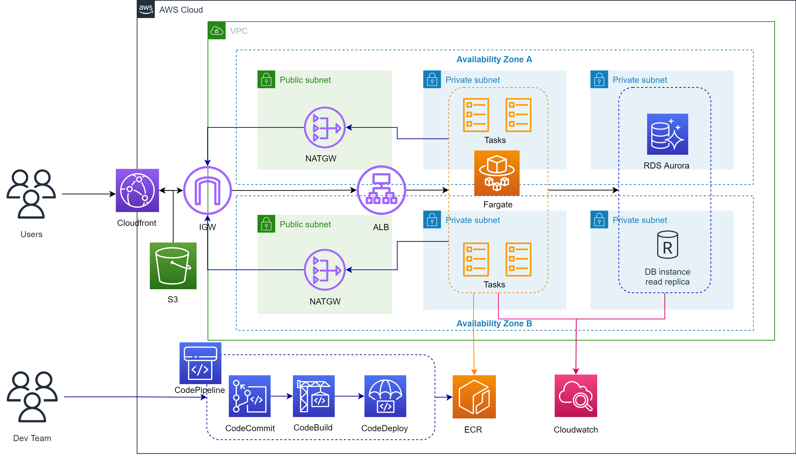
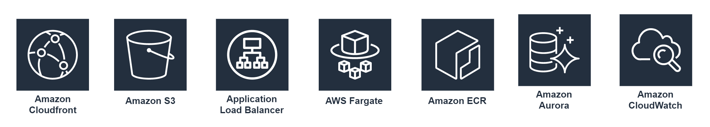
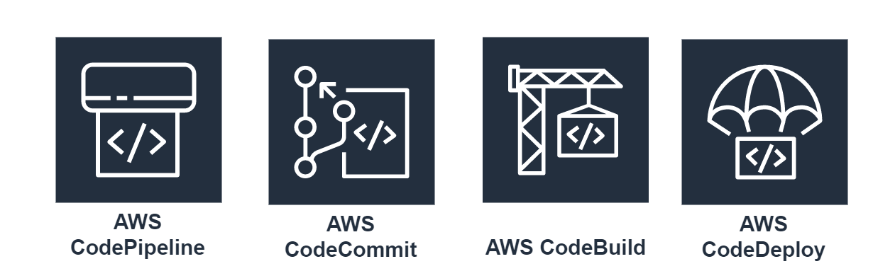

# System Infrastructure

## Infra Design

The infra design above is created based on the given requirements considering also the 5 pillars of AWS Well-Architected Framework – Operational Excellence, Security, Reliability, Performance Efficiency and Cost Optimization.

1. **Operational Excellence**. When architecting a cloud environment, we always consider that at any point there could be a failure. Hence, implementing multi-region or multi-AZ setup is really a must for a production environment. It is also a good practice to deploy the components via CloudFormation or any IaaC solutions to speed up the setup and to standardize all deployment of resources.

   Adding monitoring tools and setting alarms also adds to operational excellence. Using CloudWatch as defined in the diagram, we can monitor containers running within the cluster, the database metrics and all. In case of any alarms, we trigger a notification via SES or SNS to notify the stakeholders.

2. **Security**. As shown in the diagram, application running on containers and RDS are placed in a private subnet. The reason behind is we don’t want our compute components and data be exposed directly over the internet. We can use the NAT Gateway to reach the internet within the private subnet without totally exposing our private components publicly.

   Even not shown in the diagram, IAM roles and policies are also set per components. This is to limit who can access and use certain resources.

3. **Reliability**. To achieve high availability and resiliency, I created 2 availability zones (though you can have more than two depending on the region). In case of any failure on one AZ, we can auto failover to another. To distribute workload, I have used application load balancer.

4. **Performance Efficiency**. To flexibly scale as the demand increases, we can use serverless technology like Fargate. One good thing also when using Fargate is that you no longer need to think of the management of underlying VMs – we can just focus on the code and deployment.

5. **Cost Optimization**. Using ECS backed with EC2 doesn’t guarantee us that we fully maximize the filesystem, memory and compute capacity. Hence, using serverless like Fargate can lessen the cost as we only need to pay for what we have consumed.

   To further save cost, for ECS we can use a combination of Fargate and Fargate Spot instance

#### Side Notes:

> As the rise of microservices, monolith legacy applications are now modularized. Same with the requirements, each function can be built into separate containers. This is a best practice as it also helps the development team deploy codes continuously with less chances of breaking the entire application/system. With AWS, we can orchestrate containers using AWS’ proprietary solution **ECS** or a managed Kubernetes control plane with **EKS**.

> As we are working in AWS, we can also leverage its CICD Suite. As shown in the diagram, we can use CodeCommit as the git repository (an alternative could be GitHub, GitLab, etc), CodeBuild to compile codes, run test cases and create packages prior deployment, CodeDeploy to deploy the built packages/software to EC2, Lambda, etc.

## What additional questions should you ask PO in the future to design better? If you have, please describe it.

1. Do we have an expected traffic volume? How 'bout the number of users?

   > When architecting an environment, be it on-prem/under cloud or on the cloud, it is important to take into consideration the volume of traffic and users. This is a dependency in selecting instance type or the compute requirement we need to provision.

2. Are we creating multiple environments for dev/test? Dev, Staging, Prod and DR?

   > It is suggested to have at least a staging env where the project team can do testing (of any sort, NFT, smoke test, volume test, etc). Normally a staging env has prod-like spec, but still varies depending on the project budget.

3. Are we using 3rd party services for VA and security check?
   > I suggest having one. There are many solutions like Prisma, though this has a cost of course.

## Infra Components Breakdown

## System Components

1. **Cloudfront** - Use as content delivery network (CDN). This is where our users connects to access the application and download contents

2. **S3** - This is where the static resources and other objects can be stored

3. **ALB** - This load balances the traffic among the running tasks/containers within the ECS Fargate Cluster

4. **ECS Fargate** - A container orchestrator offered by AWS. Fargate is serverless compute engine

5. **ECR** - This is the container repository (same like Harbor and Dokerhub)

6. **RDS Aurora** - This is a managed relational database service. Both MySQL and PostgeSQL are supported

7. **Cloudwatch** - Used for monitoring and configuring alarms based on metrics

## CICD Components

1. **CodePipeline** - This is a fully manages CICD service of AWS

2. **CodeCommit** - As mentioned previously, this is where our code lies. A git repository like GitHub and GitLab

3. **CodeBuild** - This is where we compile our code, run test and build artifacts

4. **CodeDeploy** - This is used to easily deploy our build software/application to other AWS services (e.g. EC2, Lambda, etc)
