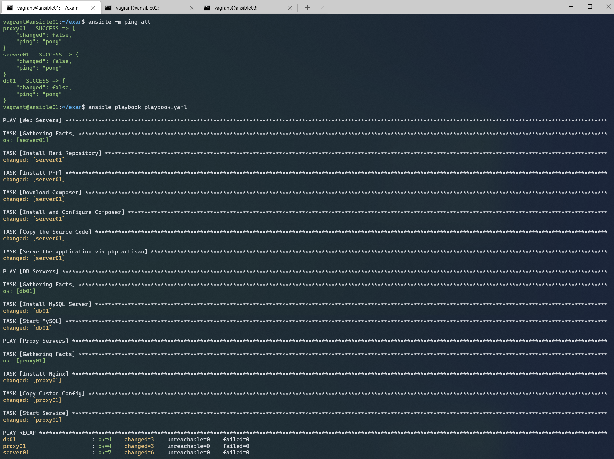

### Write an Ansible recipe that builds an environment of nginx, mysql, laravel into an instance of ec2 that can withstand the production environment.

### **How to setup and run**:

> Update the inventory below. Set hostnames, IP addresses, etc.

```
[webservers]
server01 ansible_host=<IP>
server02 ansible_host=<IP>
server03 ansible_host=<IP>

[databases]
db01 ansible_host=<IP>

[webproxy]
proxy01 ansible_host=<IP>

[all:vars]
remote_user                  = <Set User>
ansible_ssh_private_key_file = <Set PrivateKey Path>
ansible_python_interpreter   = <Set Default Python Path>
```

> Once updated. Make sure you are int the _3_ansible_ directory and run the command below:

```
ansible-playbook cloud-devops-recipe.yaml
```

### **Assumptions**:

> 1. The application source code is readily available.

> 2. Instances are already provisioned with keys setup for passwordless connection.

> 3. To handle prod-spec setup, ansible inventory is setup with IP addresses for **webservers**, **databases**, and **webproxy**

### Screenshots


