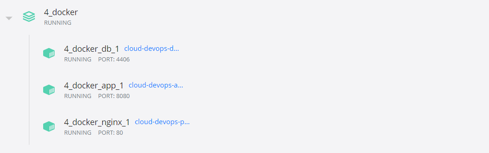
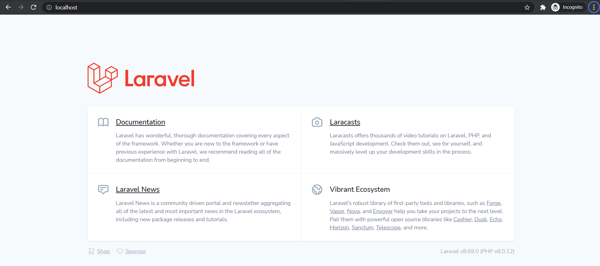

### Create a docker image, DockerFile and DockerCompose file when the environment created above be dockerized.

> To run, make sure you are in the _4_docker_ directory and run the command below:

```
docker-compose up
```

### Compose File

> Environment variables are set in this file and can be change during the pipeline build/deployment.

```yaml
version: "3.8"
services:
  db:
    build: ./mysql
    image: cloud-devops-db:latest
    command: --default-authentication-plugin=mysql_native_password
    restart: always
    environment:
      MYSQL_PASS: "${MYSQL_ROOT_PASSWORD}"
      MYSQL_DATABASE: "${MYSQL_DATABASE}"
    ports:
      - 4406:3306
    volumes:
      - type: bind
        source: ./mysql/lib
        target: /var/lib/mysql
    networks:
      - local
  app:
    build: ./app
    image: cloud-devops-app:latest
    restart: always
    ports:
      - 8080:8080
    environment:
      MYSQL_HOST: "db"
      MYSQL_USER: "root"
      MYSQL_PORT: 4406
      MYSQL_PASS: "${MYSQL_ROOT_PASSWORD}"
      MYSQL_DATABASE: "${MYSQL_DATABASE}"
    links:
      - db
    networks:
      - local
    depends_on:
      - db
  nginx:
    build: nginx
    image: cloud-devops-proxy:latest
    restart: always
    environment:
      WAIT_HOSTS: app:8080
    volumes:
      - type: bind
        source: ./nginx/conf.d
        target: /etc/nginx/conf.d
      - type: bind
        source: ./nginx/logs
        target: /var/log/nginx
    ports:
      - 80:80
    networks:
      - local
    depends_on:
      - app
networks:
  local:
    driver: bridge
```

### Setup

> Nginx serves as proxy to expose the Laravel app via port 80. **When in production, ofcourse SSL cert is required.**

> The Laravel app is just the default template; nothing fancy. **But in real world, this app will be developed by the development team.**

### Screenshots




